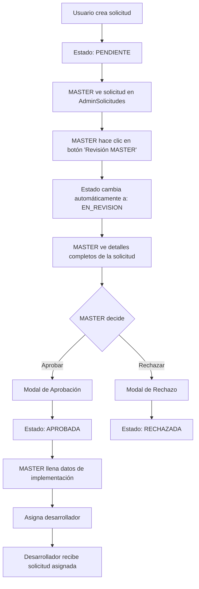

# Flujo MASTER para Solicitudes de Cambio

## Resumen de Implementación

Se ha implementado un flujo completo para que el MASTER pueda gestionar las solicitudes de cambio con las siguientes características:

### 🎯 Funcionalidades Implementadas

#### 1. **Vista de Solicitudes con Botón MASTER**
- **Ubicación**: `src/components/admin/AdminSolicitudes.jsx`
- **Funcionalidad**: Botón rojo "Revisión MASTER" visible para solicitudes en estados:
  - `PENDIENTE`
  - `EN_REVISION` 
  - `APROBADA`
- **Navegación**: Lleva a `/admin/solicitudes/master/:id`

#### 2. **Componente DetalleSolicitudMaster**
- **Ubicación**: `src/components/admin/DetalleSolicitudMaster.jsx`
- **Características**:
  - **1,042 líneas** de código completo
  - Interfaz moderna con Material-UI
  - Tabs organizados por categoría
  - Formularios interactivos con validación

### 🔄 Flujo Completo Implementado



### 📋 Funcionalidades Detalladas

#### **Cambio Automático de Estado**
- Al abrir una solicitud `PENDIENTE`, automáticamente pasa a `EN_REVISION`
- Esto indica que el MASTER ya está revisando la solicitud

#### **Modal de Aprobación/Rechazo**
- **Aprobar**: Permite agregar comentarios del MASTER
- **Rechazar**: Requiere motivo específico del rechazo + comentarios

#### **Modal de Configuración de Implementación**
Organizado en **4 secciones expandibles**:

1. **Evaluación de Impactos y Riesgos**
   - Impacto de Negocio: BAJO | MEDIO | ALTO | CRÍTICO
   - Impacto Técnico: BAJO | MEDIO | ALTO | CRÍTICO  
   - Riesgo del Cambio: BAJO | MEDIO | ALTO | CRÍTICO
   - Categoría: NORMAL | EXPEDITO | EMERGENCIA | ESTÁNDAR

2. **Planificación Temporal**
   - Fecha y Hora de Inicio (DateTimePicker)
   - Fecha y Hora de Fin (DateTimePicker)
   - Tiempo Estimado en horas
   - **Desarrollador Asignado** (Dropdown con desarrolladores)

3. **Planes Técnicos**
   - Plan de Implementación (Textarea)
   - Plan de Roll-out (Textarea) 
   - Plan de Back-out (Textarea)
   - Plan de Testing (Textarea)

4. **Comentarios Adicionales**
   - Comentarios del MASTER (Textarea)

### 🎨 Interfaz de Usuario

#### **Diseño Visual**
- **Header**: Título de solicitud + ID + Estado (chip colorido)
- **Barra de Progreso**: Visual del estado actual (0-100%)
- **Stepper**: Pasos del flujo de solicitud
- **4 Tabs Organizados**:
  1. **Información General**: Datos básicos del usuario
  2. **Detalles Técnicos**: Impactos, riesgos, fechas, desarrollador
  3. **Planes de Implementación**: Los 4 planes técnicos
  4. **Historial**: Timeline de la solicitud

#### **Sidebar de Acciones**
- **Botones Contextuales** según el estado:
  - `EN_REVISION`: Aprobar | Rechazar
  - `EN_REVISION`, `APROBADA`: Configurar Implementación
- **Información del Estado**: Chip + descripción
- **Última Actualización**: Timestamp

### 🔐 Control de Acceso

#### **Ruta Protegida**
```jsx
<Route 
  path="/admin/solicitudes/master/:id" 
  element={
    <MasterRoute>
      <DetalleSolicitudMaster />
    </MasterRoute>
  } 
/>
```

#### **Permisos por Estado**
- **Aprobar/Rechazar**: Solo en estado `EN_REVISION`
- **Editar Implementación**: Estados `EN_REVISION` y `APROBADA`
- **Ver Detalles**: Todos los estados

### 🛠️ Servicios Utilizados

#### **solicitudesAdminService.js**
- `obtenerSolicitudParaAdmin(id)`: Obtiene solicitud completa
- `ponerEnRevision(id)`: Cambia PENDIENTE → EN_REVISION
- `aprobarSolicitud(id, comentarios)`: Cambia EN_REVISION → APROBADA
- `rechazarSolicitud(id, comentarios, motivo)`: Cambia EN_REVISION → RECHAZADA
- `actualizarSolicitudMaster(id, datos)`: Actualiza campos de implementación
- `obtenerDesarrolladores()`: Lista desarrolladores disponibles

### 📱 Responsive Design

#### **Adaptativo**
- **Desktop**: Layout de 2 columnas (contenido + sidebar)
- **Mobile**: Stack vertical con prioridad al contenido
- **Tablets**: Híbrido según orientación

#### **Componentes Responsivos**
- Grid system con breakpoints
- Diálogos fullWidth en móviles
- Botones que se adaptan al tamaño de pantalla

### 🔄 Estados de la Solicitud

```
PENDIENTE → EN_REVISION → APROBADA → EN_DESARROLLO → COMPLETADA
     ↓           ↓
   (auto)    RECHAZADA
```

#### **Colores por Estado**
- `PENDIENTE`: Warning (Naranja)
- `EN_REVISION`: Info (Azul)
- `APROBADA`: Success (Verde)
- `RECHAZADA`: Error (Rojo)
- `EN_DESARROLLO`: Primary (Azul oscuro)
- `COMPLETADA`: Success (Verde)

### 🎯 Validaciones Implementadas

#### **Formulario de Rechazo**
- Motivo del rechazo es **obligatorio**
- Comentarios opcionales pero recomendados

#### **Formulario de Implementación**
- Todos los campos opcionales (flexibilidad)
- Desarrollador asignado se puede cambiar
- Fechas con validación de coherencia

#### **Estados de Carga**
- Spinners durante operaciones async
- Botones deshabilitados durante procesamiento
- Mensajes de error y éxito

### 📊 Información Mostrada

#### **Datos del Usuario**
- Solicitante (nombre completo)
- Fecha de creación
- Prioridad (chip colorido)
- Tipo de cambio
- Descripción y justificación

#### **Datos Técnicos**
- Impactos (negocio, técnico)
- Riesgo del cambio
- Categoría del cambio
- Fechas planificadas
- Tiempo estimado
- Desarrollador asignado

#### **Planes de Implementación**
- Plan de implementación
- Plan de roll-out
- Plan de back-out  
- Plan de testing

### 🚀 Próximos Pasos

Una vez que el MASTER complete este flujo:

1. **Solicitud APROBADA** → Desarrollador puede verla
2. **Desarrollador asignado** → Recibe notificación
3. **Campos completados** → Listos para desarrollo
4. **GitHub Integration** → Rama y PR automáticos

### 🔧 Archivos Modificados

1. **`src/components/admin/AdminSolicitudes.jsx`**
   - Agregado botón "Revisión MASTER"
   - Importado useNavigate y AdminPanelSettings
   - Navegación a ruta específica

2. **`src/components/admin/DetalleSolicitudMaster.jsx`**
   - Componente completo de 1,042 líneas
   - Toda la funcionalidad implementada

3. **`src/App.jsx`**
   - Agregada ruta `/admin/solicitudes/master/:id`
   - Importado DetalleSolicitudMaster
   - Protegida con MasterRoute

### ✅ Testing Recomendado

#### **Flujo Completo**
1. Crear solicitud como usuario
2. Acceder como MASTER a AdminSolicitudes
3. Hacer clic en botón "Revisión MASTER"
4. Verificar cambio automático a EN_REVISION
5. Probar aprobar con comentarios
6. Probar configurar implementación
7. Asignar desarrollador
8. Verificar que desarrollador ve la solicitud

#### **Casos Edge**
- Solicitudes sin desarrollador asignado
- Formularios con campos vacíos
- Navegación entre tabs
- Responsive en diferentes dispositivos

### 🎉 Resultado Final

El MASTER ahora tiene **control completo** sobre el flujo de solicitudes:
- ✅ Ve todas las solicitudes
- ✅ Cambia estados automáticamente  
- ✅ Aprueba/rechaza con justificación
- ✅ Configura implementación completa
- ✅ Asigna desarrolladores
- ✅ Interfaz moderna y responsive
- ✅ Validaciones robustas
- ✅ Experiencia de usuario optimizada 