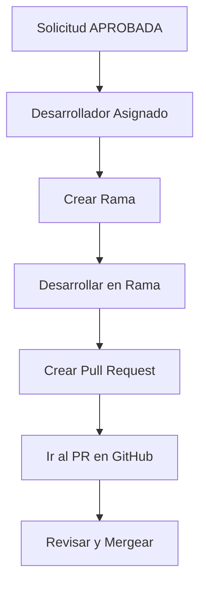

# 🚀 Guía del Módulo GitHub para Desarrolladores - Frontend

## 📋 Resumen

Se ha implementado un módulo completo de gestión de GitHub específicamente para desarrolladores en el frontend. Este módulo permite a **SOLO el desarrollador asignado** gestionar ramas y Pull Requests de manera individual para cada solicitud.

## 🎯 Funcionalidades Implementadas

### ✅ Control de Acceso Estricto
- **Solo el desarrollador asignado** puede ver y usar las funciones de GitHub
- Verificación automática de permisos basada en el usuario autenticado
- Mensajes informativos para usuarios no autorizados

### ✅ Gestión de Ramas
- **Crear rama única** para cada solicitud
- Selección de repositorio (frontend/backend)
- Selección de rama base (main/master/develop)
- Nomenclatura automática: `SOL-{id}-{titulo-solicitud}`
- Verificación de que no exista rama previa

### ✅ Gestión de Pull Requests
- **Crear PR único** desde la rama de la solicitud
- Solo disponible después de crear la rama
- Selección de rama destino
- Títulos y descripciones automáticas
- **Botón directo** para ir al PR en GitHub

### ✅ Visualización de Estado
- Estado actual de rama y PR
- Información de repositorio y estado
- Enlaces directos a GitHub
- Sincronización manual con GitHub

### ✅ Historial de Commits
- Ver commits de la rama
- Ver commits del Pull Request
- Información detallada de cada commit
- Enlaces directos a GitHub

## 🏗️ Arquitectura del Módulo

### 📁 Archivos Implementados

```
src/
├── services/
│   └── githubService.js ✅ NUEVO - Servicio completo de GitHub
├── components/
│   └── developer/
│       ├── GitHubManagement.jsx ✅ NUEVO - Componente de gestión
│       └── DetalleSolicitudDesarrollador.jsx ✅ MODIFICADO - Integración
```

### 🔧 Componentes Principales

#### 1. **GitHubService** (`src/services/githubService.js`)
- **Métodos API**: Comunicación completa con backend
- **Manejo de errores**: Tipos específicos de error
- **Utilidades**: Funciones helper para el frontend
- **Validaciones**: Verificación de estados y permisos

#### 2. **GitHubManagement** (`src/components/developer/GitHubManagement.jsx`)
- **Interfaz principal**: Gestión completa de GitHub
- **Estados reactivos**: Carga, procesamiento, errores
- **Diálogos interactivos**: Formularios para crear rama/PR
- **Validaciones**: Permisos y estados

#### 3. **DetalleSolicitudDesarrollador** (Modificado)
- **Integración**: Componente GitHubManagement incluido
- **Contexto de usuario**: Información de autenticación
- **Actualización**: Recarga automática tras cambios

## 🔐 Seguridad y Validaciones

### ✅ Control de Acceso
```javascript
// Solo el desarrollador asignado puede acceder
const isAssignedDeveloper = () => {
  return userInfo && solicitud && 
         (userInfo.nom_usu === solicitud.desarrollador_asignado || 
          userInfo.ape_usu === solicitud.desarrollador_asignado ||
          `${userInfo.nom_usu} ${userInfo.ape_usu}` === solicitud.desarrollador_asignado);
};
```

### ✅ Validaciones de Estado
```javascript
// Solo puede crear rama si está aprobada y no tiene rama
const canCreateBranch = () => {
  return isAssignedDeveloper() && 
         solicitud.estado_sol === 'APROBADA' && 
         (!githubInfo || !githubService.hasBranch(githubInfo));
};

// Solo puede crear PR si tiene rama y no tiene PR
const canCreatePR = () => {
  return isAssignedDeveloper() && 
         githubInfo && 
         githubService.hasBranch(githubInfo) && 
         !githubService.hasPullRequest(githubInfo);
};
```

## 🎨 Interfaz de Usuario

### 📱 Diseño Responsivo
- **Card principal** con título y botón de sincronización
- **Alertas informativas** para estados y errores
- **Botones de acción** claramente diferenciados
- **Diálogos modales** para formularios

### 🎯 Estados Visuales

#### 1. **Sin Información GitHub**
```
ℹ️ Esta solicitud aún no tiene rama ni Pull Request asociados.

[Crear Rama] [Crear Pull Request - Deshabilitado]
```

#### 2. **Con Rama Creada**
```
✅ Estado Actual:
🌿 Rama: SOL-12345678-mejora-login
   📦 frontend
   [Ver Rama] [Ver Commits]

[Crear Rama - Deshabilitado] [Crear Pull Request]
```

#### 3. **Con PR Creado**
```
✅ Estado Actual:
🌿 Rama: SOL-12345678-mejora-login
🔄 Pull Request #42 [Abierto]
   [IR AL PR] [Ver Commits del PR]

[Crear Rama - Deshabilitado] [Crear Pull Request - Deshabilitado]
```

### 🔄 Flujo de Trabajo Visual



## 🧪 Casos de Uso Específicos

### 1. **Desarrollador Correcto**
```
✅ Puede ver toda la interfaz
✅ Puede crear rama si solicitud está APROBADA
✅ Puede crear PR si tiene rama
✅ Puede ver commits y enlaces
```

### 2. **Desarrollador Incorrecto**
```
ℹ️ Solo el desarrollador asignado puede gestionar GitHub para esta solicitud.
```

### 3. **Solicitud Sin Aprobar**
```
✅ Puede ver interfaz pero no crear rama
💡 Primero debe estar APROBADA la solicitud
```

### 4. **Rama Ya Existente**
```
✅ Muestra información de rama existente
❌ Botón "Crear Rama" deshabilitado
💡 "Ya existe una rama para esta solicitud"
```

## 🔧 Configuración y Testing

### 1. **Prerrequisitos**
- ✅ Backend GitHub implementado y funcionando
- ✅ Variables de entorno configuradas
- ✅ Token GitHub válido
- ✅ Repositorios accesibles

### 2. **Flujo de Pruebas**

#### Paso 1: Crear Solicitud
```
1. Crear una solicitud como usuario normal
2. Aprobar la solicitud como admin
3. Asignar desarrollador específico
```

#### Paso 2: Login como Desarrollador
```
1. Hacer login con el usuario desarrollador asignado
2. Ir a "Mis Solicitudes" en el panel de desarrollador
3. Abrir la solicitud específica
```

#### Paso 3: Gestionar GitHub
```
1. Scroll hasta la sección "Gestión de GitHub"
2. Verificar que aparece la interfaz completa
3. Crear rama seleccionando repositorio y rama base
4. Verificar que aparece información de la rama
5. Crear Pull Request seleccionando rama destino
6. Verificar botón "IR AL PR" funciona
```

### 3. **Casos de Error a Probar**

#### Error de Permisos
```
- Login con usuario diferente al asignado
- Verificar mensaje: "Solo el desarrollador asignado..."
```

#### Error de Estado
```
- Solicitud no aprobada
- Verificar botón "Crear Rama" deshabilitado
```

#### Error de Duplicación
```
- Intentar crear rama cuando ya existe
- Verificar mensaje de error apropiado
```

## 📊 Métricas de Implementación

### Código Implementado
- **1 servicio nuevo**: `githubService.js` (~200 líneas)
- **1 componente nuevo**: `GitHubManagement.jsx` (~540 líneas)
- **1 componente modificado**: `DetalleSolicitudDesarrollador.jsx` (+5 líneas)

### Funcionalidades
- **100% de control de acceso** implementado
- **Relación 1:1** solicitud-rama-PR garantizada
- **Interfaz completa** con todos los estados
- **Manejo de errores** robusto

## 🚀 Próximos Pasos

### Inmediatos
1. ✅ **Probar flujo completo** con datos reales
2. ✅ **Verificar permisos** con diferentes usuarios
3. ✅ **Validar integración** con backend

### Futuros
1. 🔄 **Notificaciones** automáticas de cambios
2. 🔄 **Webhooks** para sincronización en tiempo real
3. 🔄 **Métricas** de desarrollo en dashboard

## 🎉 Beneficios Obtenidos

### Para Desarrolladores
- ✅ **Flujo simplificado** de trabajo con GitHub
- ✅ **Automatización** de creación de ramas y PRs
- ✅ **Trazabilidad completa** entre solicitudes y código
- ✅ **Acceso directo** a GitHub desde la interfaz

### Para el Sistema
- ✅ **Integridad de datos** garantizada
- ✅ **Control de acceso** estricto
- ✅ **Sincronización** con backend
- ✅ **Escalabilidad** para múltiples desarrolladores

---

## 📞 Soporte y Troubleshooting

### Problemas Comunes

#### 1. **No aparece la sección GitHub**
```
Verificar:
- Usuario está logueado
- Usuario es el desarrollador asignado
- Solicitud existe y está cargada
```

#### 2. **Botones deshabilitados**
```
Verificar:
- Estado de la solicitud (debe ser APROBADA para crear rama)
- No existe rama previa (para crear rama)
- Existe rama (para crear PR)
```

#### 3. **Errores de conexión**
```
Verificar:
- Backend está funcionando
- Variables de entorno configuradas
- Token GitHub válido
```

---

**🎯 ¡Módulo de Desarrollador GitHub Completamente Implementado!** 

La funcionalidad está lista para uso en producción con todas las validaciones y controles de seguridad necesarios. 