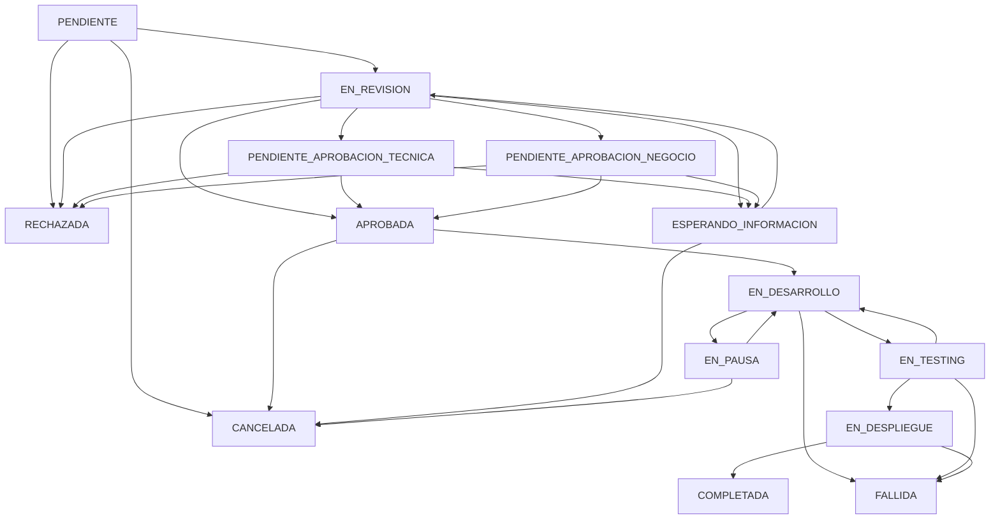

# Sistema de Solicitudes de Cambio Mejorado

## 🎯 Objetivo

Este sistema implementa un flujo de solicitudes de cambio robusto similar a Jira Service Management, separando claramente los campos que completa el solicitante de aquellos que gestiona el equipo técnico/administrativo.

## 📋 Características Principales

### ✅ Separación de Responsabilidades
- **Campos del Solicitante**: Información básica y justificación del cambio
- **Campos del Administrador**: Evaluación técnica, planificación y seguimiento

### ✅ Estados Detallados
- 16 estados diferentes que cubren todo el ciclo de vida del cambio
- Transiciones controladas entre estados
- Fechas automáticas según el estado

### ✅ Evaluación de Riesgo
- Categorización de riesgo técnico
- Tipos de cambio según su naturaleza
- Urgencia vs Prioridad (conceptos separados)

### ✅ Planificación Completa
- Planes de implementación, rollback y testing
- Gestión de ventanas de mantenimiento
- Seguimiento de tiempos estimados vs reales

## 🗂️ Estructura de Campos

### 👤 Campos Completados por el Solicitante

| Campo | Tipo | Requerido | Descripción |
|-------|------|-----------|-------------|
| `titulo_sol` | string | ✅ | Título descriptivo del cambio |
| `descripcion_sol` | text | ✅ | Descripción detallada del cambio |
| `justificacion_sol` | text | ✅ | Por qué es necesario este cambio |
| `tipo_cambio_sol` | enum | ✅ | Tipo de cambio solicitado |
| `prioridad_sol` | enum | ❌ | Prioridad desde perspectiva del negocio |
| `urgencia_sol` | enum | ❌ | Qué tan urgente es la implementación |
| `impacto_negocio_sol` | text | ❌ | Impacto en el negocio/usuarios |
| `beneficios_esperados_sol` | text | ❌ | Beneficios que se esperan obtener |
| `recursos_necesarios_sol` | text | ❌ | Estimación de recursos necesarios |
| `fecha_limite_deseada` | date | ❌ | Fecha límite deseada por el usuario |
| `usuarios_afectados_sol` | text | ❌ | Quiénes se verán afectados |

### 🔧 Campos Gestionados por el Administrador

#### Evaluación y Categorización
| Campo | Tipo | Descripción |
|-------|------|-------------|
| `riesgo_cambio` | enum | Evaluación del riesgo técnico (BAJO, MEDIO, ALTO, CRITICO) |
| `categoria_cambio` | enum | Categoría del cambio (NORMAL, EXPEDITO, EMERGENCIA, ESTANDAR) |

#### Planificación
| Campo | Tipo | Descripción |
|-------|------|-------------|
| `plan_implementacion` | text | Plan detallado de implementación |
| `plan_rollback` | text | Plan de reversa en caso de problemas |
| `plan_testing` | text | Plan de pruebas |

#### Fechas y Tiempos
| Campo | Tipo | Descripción |
|-------|------|-------------|
| `fecha_inicio_planificada` | date | Fecha planificada de inicio |
| `fecha_fin_planificada` | date | Fecha planificada de finalización |
| `fecha_inicio_real` | date | Fecha real de inicio |
| `fecha_fin_real` | date | Fecha real de finalización |
| `tiempo_estimado_horas` | int | Tiempo estimado en horas |
| `tiempo_real_horas` | int | Tiempo real utilizado |

#### Mantenimiento
| Campo | Tipo | Descripción |
|-------|------|-------------|
| `requiere_mantenimiento` | boolean | Si requiere ventana de mantenimiento |
| `ventana_mantenimiento_inicio` | timestamp | Inicio de la ventana |
| `ventana_mantenimiento_fin` | timestamp | Fin de la ventana |

#### Aprobaciones
| Campo | Tipo | Descripción |
|-------|------|-------------|
| `requiere_aprobacion_adicional` | boolean | Si necesita aprobaciones extra |
| `aprobadores_adicionales` | text (JSON) | Lista de aprobadores adicionales |
| `fecha_aprobacion_tecnica` | timestamp | Fecha de aprobación técnica |
| `fecha_aprobacion_negocio` | timestamp | Fecha de aprobación de negocio |

#### Documentación y Seguimiento
| Campo | Tipo | Descripción |
|-------|------|-------------|
| `documentos_adjuntos` | text (JSON) | Referencias a documentos |
| `enlaces_relacionados` | text | URLs relacionadas |
| `cambios_relacionados` | text | IDs de otros cambios |
| `comunicacion_usuarios` | text | Plan de comunicación |

#### Métricas y Resultados
| Campo | Tipo | Descripción |
|-------|------|-------------|
| `exito_implementacion` | boolean | Si fue exitosa la implementación |
| `problemas_encontrados` | text | Problemas durante implementación |
| `lecciones_aprendidas` | text | Lecciones aprendidas |
| `satisfaccion_usuario` | int | Satisfacción del usuario (1-5) |

## 📊 Estados del Sistema

### Estados Iniciales
- **PENDIENTE**: Recién creada, esperando revisión inicial
- **EN_REVISION**: Siendo evaluada por el equipo técnico

### Estados de Aprobación
- **PENDIENTE_APROBACION_TECNICA**: Esperando aprobación técnica
- **PENDIENTE_APROBACION_NEGOCIO**: Esperando aprobación de negocio
- **APROBADA**: Aprobada y lista para implementar

### Estados de Rechazo
- **RECHAZADA**: Rechazada con retroalimentación
- **CANCELADA**: Cancelada por el solicitante

### Estados de Implementación
- **EN_DESARROLLO**: En proceso de implementación
- **EN_TESTING**: En fase de pruebas
- **EN_DESPLIEGUE**: Siendo desplegada

### Estados Finales
- **COMPLETADA**: Exitosamente implementada
- **FALLIDA**: Implementación falló
- **CERRADA**: Cerrada administrativamente

### Estados Especiales
- **EN_PAUSA**: Pausada temporalmente
- **ESPERANDO_INFORMACION**: Necesita más información del solicitante

## 🔄 Flujo de Transiciones



## 🛠️ Tipos de Cambio

1. **NUEVA_FUNCIONALIDAD**: Agregar una característica completamente nueva
2. **MEJORA_EXISTENTE**: Mejorar una funcionalidad que ya existe
3. **CORRECCION_ERROR**: Solucionar un problema o bug
4. **CAMBIO_INTERFAZ**: Modificar la interfaz de usuario
5. **OPTIMIZACION**: Mejorar el rendimiento o eficiencia
6. **ACTUALIZACION_DATOS**: Modificar o actualizar información
7. **CAMBIO_SEGURIDAD**: Mejoras relacionadas con seguridad
8. **MIGRACION_DATOS**: Transferir o migrar información
9. **INTEGRACION_EXTERNA**: Conectar con sistemas externos
10. **OTRO**: Otro tipo de cambio no especificado

## 📈 Prioridades y Urgencia

### Prioridad (Perspectiva del Negocio)
- **BAJA**: No es urgente, puede esperar
- **MEDIA**: Prioridad normal
- **ALTA**: Requiere atención pronto
- **CRITICA**: Muy importante, alta prioridad
- **URGENTE**: Máxima prioridad, inmediato

### Urgencia (Perspectiva de Tiempo)
- **BAJA**: Puede esperar más de 30 días
- **NORMAL**: Necesario en 2-4 semanas
- **ALTA**: Necesario en 1-2 semanas
- **URGENTE**: Necesario esta semana
- **CRITICA**: Necesario inmediatamente

## ⚠️ Evaluación de Riesgo

- **BAJO**: Sin impacto significativo, fácil rollback
- **MEDIO**: Impacto limitado, rollback posible
- **ALTO**: Impacto significativo, rollback complejo
- **CRITICO**: Alto impacto, rollback muy difícil

## 🏷️ Categorías de Cambio

- **NORMAL**: Cambio estándar con proceso normal
- **EXPEDITO**: Cambio urgente con proceso simplificado
- **EMERGENCIA**: Cambio crítico que bypassa algunos controles
- **ESTANDAR**: Cambio pre-aprobado con bajo riesgo

## 🚀 Endpoints API

### Para Usuarios
- `POST /api/solicitudes-cambio/solicitud-nueva` - Crear solicitud
- `GET /api/solicitudes-cambio/mis-solicitudes` - Ver mis solicitudes
- `GET /api/solicitudes-cambio/mis-solicitudes/:id` - Ver solicitud específica

### Para Administradores
- `GET /api/solicitudes-cambio/admin/todas` - Ver todas las solicitudes
- `GET /api/solicitudes-cambio/admin/:id` - Ver solicitud específica
- `PUT /api/solicitudes-cambio/admin/:id/gestion-tecnica` - **NUEVO** Gestionar aspectos técnicos
- `PUT /api/solicitudes-cambio/admin/:id/responder` - Responder solicitud
- `PUT /api/solicitudes-cambio/admin/:id/estado` - Actualizar estado
- `GET /api/solicitudes-cambio/admin/estadisticas` - Ver estadísticas

## 📝 Cómo Usar el Sistema

### Para Solicitantes
1. Completar el formulario con la información básica del cambio
2. Proporcionar justificación clara del por qué es necesario
3. Estimar impacto en el negocio y usuarios afectados
4. Indicar urgencia y fecha límite deseada

### Para Administradores
1. Revisar la solicitud inicial
2. Evaluar el riesgo técnico y categorizar el cambio
3. Crear planes de implementación, rollback y testing
4. Establecer fechas y ventanas de mantenimiento
5. Asignar implementador si es necesario
6. Hacer seguimiento del progreso
7. Documentar lecciones aprendidas

## 🔄 Migración

Para aplicar estos cambios a tu base de datos:

1. **Generar migración de Prisma**:
   ```bash
   cd BACKEND_APP
   npx prisma migrate dev --name solicitudes_cambio_mejorado
   ```

2. **Ejecutar script de verificación**:
   ```bash
   node scripts/migrate-solicitudes-cambio-mejorado.js
   ```

3. **Regenerar cliente de Prisma**:
   ```bash
   npx prisma generate
   ```

## 🎨 Próximos Pasos

1. **Frontend**: Actualizar componentes para mostrar los nuevos campos
2. **Validaciones**: Implementar validaciones específicas por rol
3. **Notificaciones**: Sistema de notificaciones por email/web
4. **Reportes**: Dashboards de métricas y KPIs
5. **Flujos de Aprobación**: Implementar flujos de aprobación multinivel
6. **Integración**: APIs para integrar con sistemas externos

Este sistema proporciona una base sólida para un control de cambios profesional, similar a herramientas como Jira Service Management, pero adaptado a las necesidades específicas de tu organización. 